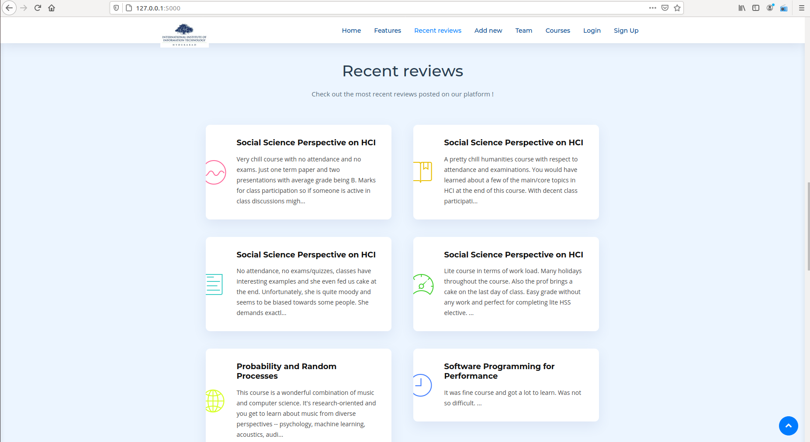
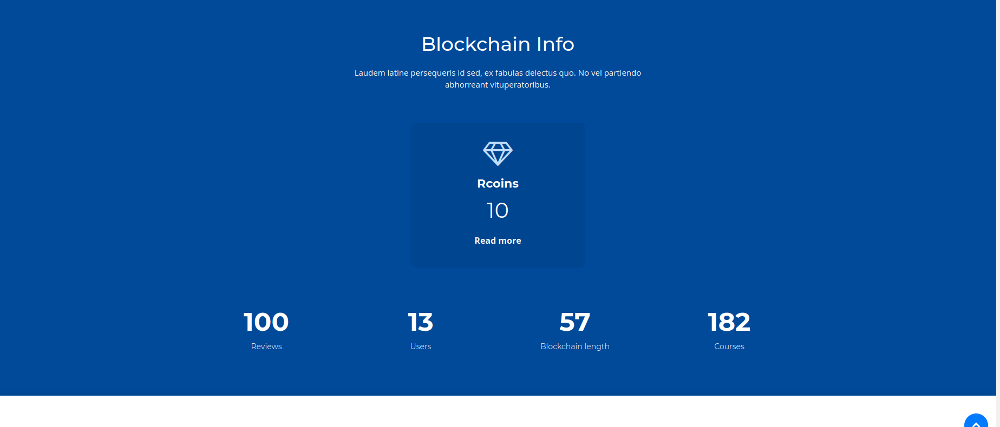
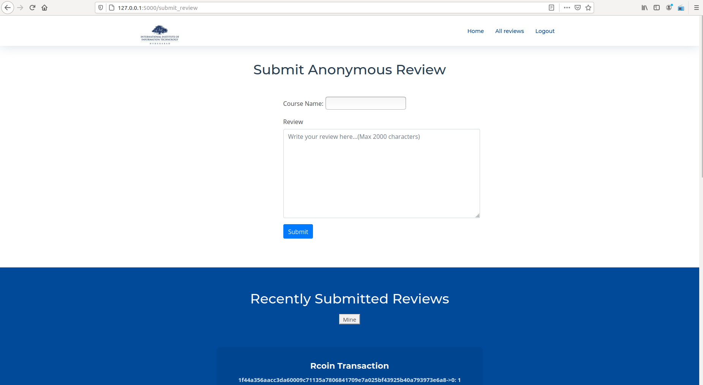
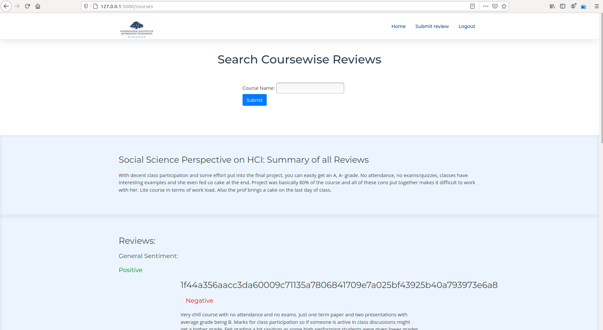

# Course review system - Web application
We are using **blockchain technology and machine learning** techniques to build a course review system. Different from the traditional centralized system, the novel anonymous review system should be secure, reliable, transparent, and tamper-resistant. The key novelty of our project is the Incentive Mechanism where the reviewer and miner are rewarded in Rcoins (ReviewCoins) which encourages users to write anonymous reviews without the worry of identity information disclosure. We used NLP and ML techniques to summarize reviews and classify them into positive, neutral and negative tags and we also gave a general sentiment regarding the course.

## Why blockchain?
In the traditional review system, we have three major problems:
1. Lack of anonymity: Reviewing with a real name is required. Hence worrying about being retaliated.
2. Lack of incentives: Reviewers are not rewarded by any means for writing reviews.
3. Lack of trust: Admin can delete reviews and modify them in a centralized system.

Blockchain-based networks are open and transparent, and promising in recording data with the good properties of tamper-resistance and decentralization.
Blockchain can provide a better incentive mechanism to encourage mobile users to perform anonymous reviews without the worry of identity information disclosure.

## Incentive Mechanism

Rcoins refer to the incentive in this blockchain based course review system. Each user has an independent digital credit account, which is used to store reputation points and which is therefore called as the Rcoins. 
Sending a review will cost Rcoins, which prevents malicious users from sending meaningless or fraudulent reviews. After a block is added successfully Reviewer and Verifier will get rewards in Rcoins. We can distinguish the users on the basis of roles. For example, not all the users have the privilege to verify the review. That way ownership will be maintained and not all people would be able to add the blocks to the chain. In case these tokens are not used for a period of time, then they will expire and no longer be used.

### Consensus Algorithm : PoW
The system generates a mathematical problem. All those involved in the consensus process will compete to be the first to find a solution to this mathematical problem. When the right solution is found, the entire network will broadcast that the user has the right to generate a new block and reward him with a small amount of Rcoins.

## Machine Learning
We have used some machine learning techniques to enhance the user experience for this platform. The techniques already deployed on the platform are described below:

#### Summarization 
User can see a summary of all the reviews given for a particular course. We have applied text summarization techniques that give a glimpse of general feedback about that course. This helps a user to quickly get an idea about any new course.
- We applied summarization on all review of a subject to give brief summary of all review.
- We have applied a mixture of tf-idf and textrank based extractive summerization in our app where we provide summary in maximum 80 words.

#### Sentiment analysis
- We have applied sentiment analysis on all the individual reviews to classify them into positive and negative categories.
- Tagging course reviews with sentiments helps user to quickly navigate to kind of reviews user is looking for. 
- We also did a sentiment analysis on the summary of the course to classify it into categories (good/moderate/bad). 
- In the initial stages of the platform usage, we won't have much data so we are using semi-supervised learning to classify the reviews and courses.
- We are using a pre-trained model currently and later we will switch to a model trained on course reviews only. Hence we have used lexicon and rule-based sentiment analysis model for the same. This model is specifically tuned for sentiments expressed on social media, and since reviews are often expressed in a free manner, this model is quite helpful.


## Inmportant files with intricacies

- Two servers run in parallel - one via `./node_server.py` and other from `./run_app.py`
- Breifly, node_server.py deals with the blockchain part and handles all the transactions.
- `run_app.py` is just to run a parallel server. All other details of the app get imported from the `./app` directory.
- `./app` directory includes the database (we have used **sqalachemy** in our project)
- `auth.py` includes the multi-user authentication policies along with handling logins and sessions.
- `models.py` includes the details of the database.
- `main.py` includes the working of the web application, from introducing the login page to submit/mine/filter the reviews.
- `constants.py` include the course names and in future it will also include the names of the static properties (like restaurant names in case of restaurant reviews).

## Instructions to run

Install the dependencies,
Some requirements will have to be added separtely as there were installation errors when mentioned in requirements.txt
```sh
$ pip install -r requirements.txt
```

Start a blockchain node server,

```sh
$ export FLASK_APP=node_server.py
$ flask run --port 8000
```

One instance of our blockchain node is now up and running at port 8000.


Run the application on a different terminal session,

```sh
$ python run_app.py
```

The application should be up and running at [http://localhost:5000](http://localhost:5000).

## Features of our app

1. Home Page


2. Features


3. Most recent reviews in a glance



4. Information about the status of the blockchain



5. Write and submit a course review



6. Search course wise reviews, helped by auto-complete feature. Each review is categorized into classes Positive/Neutral/Negative. All reviews for a particular course are summarized, to present a course summary. Also we predict the general sentiment of the reviews of the course.




