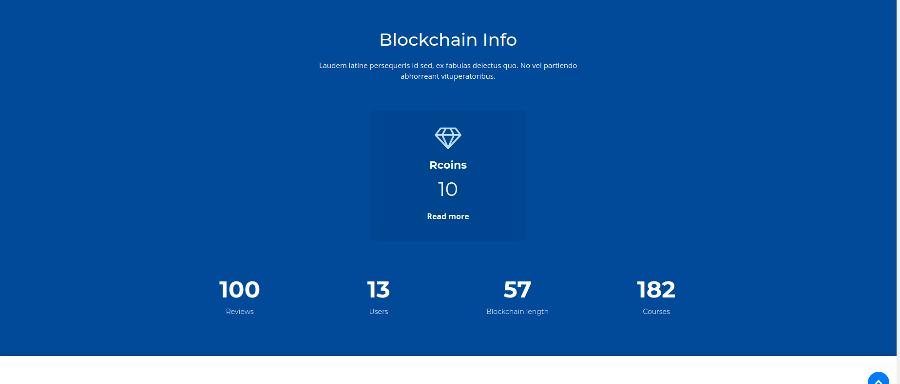

# Course review system - Web application

We propose an effective anonymous review system called ReviewCoins, a novel Blockchain-based incentive anonymous review system. Different from the traditional centralized system, the novel anonymous review system should be secure, reliable, transparent, and tamper-resistant. 

## Why blockchain?

Blockchain-based networks are open and transparent, and promising in recording data with the good properties of tamper-resistance and decentralization.
Blockchain can provide a better incentive mechanism to encourage mobile users to perform anonymous reviews without the worry of identity information disclosure.

## Rcoins

Rcoins refer to the incentive in this blockchain based course review system. Each user has an independent digital credit account, which is used to store reputation points and which is therefore called as the Rcoins. 
Sending a review will cost Rcoins, which prevents malicious users from sending meaningless or fraudulent reviews. After a block is added successfully Reviewer and Verifier will get rewards in Rcoins. We can distinguish the users on the basis of roles. For example, not all the users have the privilege to verify the review. That way ownership will be maintained and not all people would be able to add the blocks to the chain. In case these tokens are not used for a period of time, then they will expire and no longer be used. Our system generates a mathematical problem. All those involved in the consensus process will compete to be the first to find a solution to this mathematical problem.
When the right solution is found, the entire network will broadcast that the user has the right to generate a new block and reward him with a small amount of Rcoins.

## Inmportant files with intricacies

- Two servers run in parallel - one via ./node_server.py and other from ./run_app.py
- Breifly, node_server.py deals with the blockchain part and handles all the transactions.
- run_app.py is just to run a parallel server. All other details of the app get imported from the ./app directory.
- ./app directory includes the database (we have used sqlite3 in our project)
- auth.py includes the multi-user authentication policies along with handling logins and sessions.
- models.py includes the details of the database.
- main.py includes the working of the web application, from introducing the login page to submit/mine/filter the reviews.
- constants.py include the course names and in future it will also include the names of the static properties (like restaurant names in case of restaurant reviews).

## Instructions to run

Install the dependencies,
Some requirements will have to be added separtely as there were installation errors when mentioned in requirements.txt
```sh
$ cd project/dir
$ pip install -r requirements.txt
```

Start a blockchain node server,

```sh
$ export FLASK_APP=node_server.py
$ flask run --port 8000
```

One instance of our blockchain node is now up and running at port 8000.


Run the application on a different terminal session,

```sh
$ python run_app.py
```

The application should be up and running at [http://localhost:5000](http://localhost:5000).

# Features of our app

1. Home Page


2. Features


3. Most recent reviews in a glance


4. Information about the status of the blockchain



5. Write and submit a course review


6. Search course wise reviews, helped by auto-complete feature. Each review is categorized into classes Positive/Neutral/Negative. All reviews for a particular course are summarized, to present a course summary. Also we predict the general sentiment of the reviews of the course.


